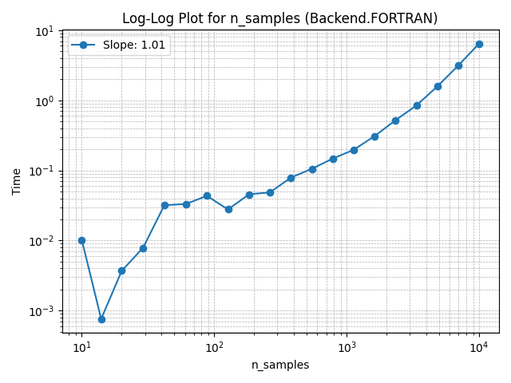
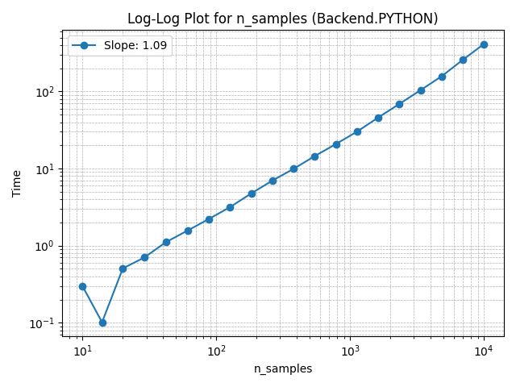
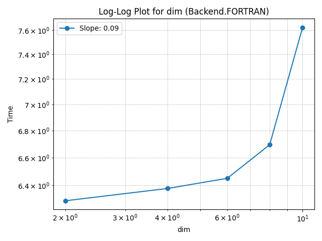
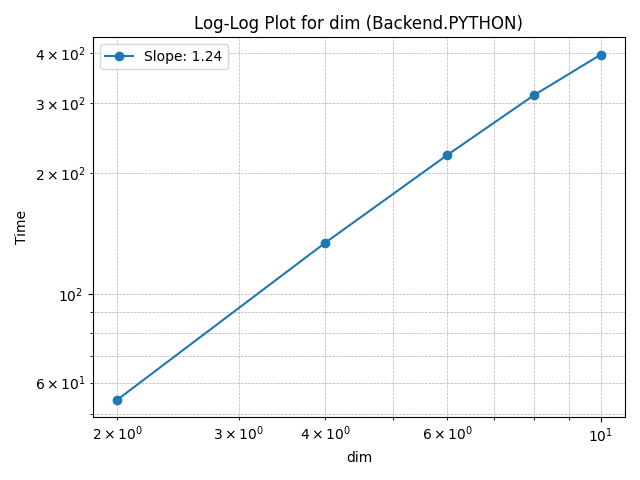
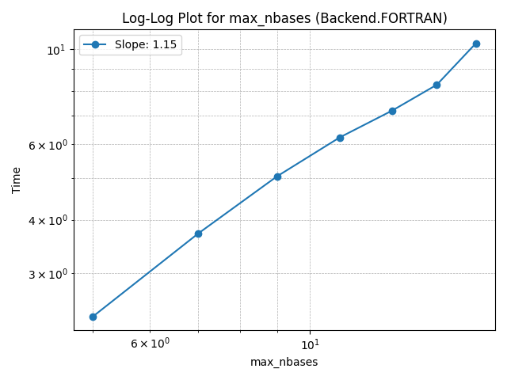
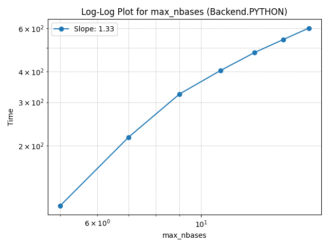

# omar

[](https://test.pypi.org/project/omar/)
<!-- [](https://badge.fury.io/py/omar) Add this once on PyPI -->

`omar` (**O**pen **M**ultivariate **A**daptive **R**egression Splines) is a Python implementation of the Multivariate Adaptive Regression Splines (MARS) algorithm developed by Jerome H. Friedman. It features an optional Fortran backend for significantly improved performance.

## Installation

### From TestPyPI (Current)

Pre-built wheels including the optimized Fortran backend are available on TestPyPI. Simply install using pip:

```bash
pip install -i https://test.pypi.org/simple/ omar
```

This provides the best performance without needing a local Fortran compiler setup.

### From PyPI (Coming Soon)

`omar` will soon be available on the main Python Package Index (PyPI) with pre-built wheels:

```bash
# Coming soon!
pip install omar
```

### Building from Source (Optional)

If you wish to build from source (e.g., for development or if wheels are not available for your platform), you will need a Fortran compiler (`gfortran`, Intel Fortran) and `f2py` (part of NumPy). The Fortran backend can typically be built using a command similar to:

```bash
# Example build command (see meson.build for actual build process)
python -m numpy.f2py -c --f90flags="-fopenmp" -m backend ./omar/backend.f90 -lgomp -lblas -llapack
```

Refer to the `meson.build` file for the definitive build instructions.

## Usage

Here's a basic example demonstrating how to use `omar`:

```python
import numpy as np
from omar import OMAR, Backend

# Generate some sample data
X = np.random.rand(100, 3) * 10
y = X[:, 0] * np.sin(X[:, 1]) + np.cos(X[:, 2]) + np.random.randn(100) * 0.1

# Initialize the OMAR model
# Request Fortran backend (default if installed via wheel)
# Falls back to Python if Fortran unavailable
try:
    model = OMAR(max_nbases=21, backend=Backend.FORTRAN)
    print("Using Fortran backend.")
except ImportError:
    print("Fortran backend not found. Using Python backend.")
    model = OMAR(max_nbases=21, backend=Backend.PYTHON)


# Fit the model to the data (find the optimal basis functions)
lof = model.find_bases(X, y)
print(f"Final Lack of Fit (LOF): {lof:.4f}")

# Display the resulting model structure
print("\nModel Structure:")
print(model)

# Make predictions on the training data
y_pred = model(X)

# Evaluate the model (e.g., using Mean Squared Error)
mse = np.mean((y - y_pred)**2)
print(f"\nMean Squared Error on training data: {mse:.4f}")

# Predict on new data
X_new = np.random.rand(50, 3) * 10
y_new_pred = model(X_new)
print(f"\nPredicted {len(y_new_pred)} values for new data.")
```

## Performance

`omar` offers two backends: a pure Python implementation and a significantly faster Fortran implementation (included in the wheels). The Fortran backend is highly recommended for performance.

### Speed Comparison (`find_bases`)

A sample run comparing the execution time for the `find_bases` step:

| Backend         | Time (seconds) |
| --------------- | -------------- |
| `Backend.FORTRAN` | 9.27           |
| `Backend.PYTHON`  | 310.24         |

*(Data from `doc/speeds_find_bases.csv`)*

### Scaling Behavior

The following plots illustrate how the runtime scales with the number of samples (`n_samples`), data dimensions (`dim`), and maximum number of basis functions (`max_nbases`) for both backends.

**Scaling with Number of Samples:**

*Fortran Backend:*


*Python Backend:*


**Scaling with Data Dimensions:**

*Fortran Backend:*


*Python Backend:*


**Scaling with Max Basis Functions:**

*Fortran Backend:*


*Python Backend:*


Generally, the Fortran backend demonstrates significantly better performance and scaling characteristics.

## Contributing

Contributions are welcome! If you'd like to contribute, please follow these steps:

1.  **Fork the repository** on GitHub.
2.  **Clone your fork** locally (`git clone git@github.com:your_username/omar.git`).
3.  **Create a new branch** for your feature or bug fix (`git checkout -b feature/your-feature-name`).
4.  **Make your changes** and commit them (`git commit -am 'Add some feature'`). Ensure your code adheres to project standards and includes tests if applicable.
5.  **Push your changes** to your fork (`git push origin feature/your-feature-name`).
6.  **Open a Pull Request** on the original `omar` repository.

## License

This project is licensed under the **MIT License**. See the `LICENSE.txt` file for full details.